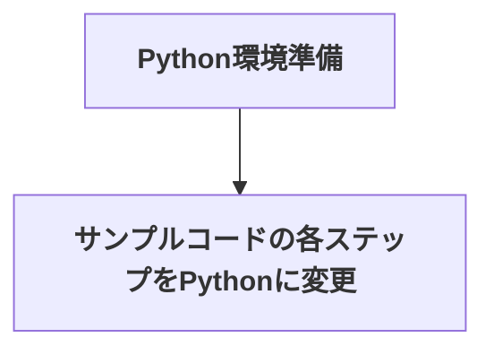

# 「GLFW による OpenGL 入門」(略) のサンプルコードをPythonに置き換える

## はじめに

和歌山大学の床井浩平先生がOpenGLの入門書をPDFで公開されています。[^1]

- [「○○くんのために一所懸命書いたものの結局○○くんの卒業に間に合わなかったGLFW による OpenGL 入門」](https://tokoik.github.io/GLFWdraft.pdf)

また、本書のサンプルコードは、GitHub上に公開されています。

- [tokoik/glfw3sample: 「GLFWによるOpenGL入門」のサンプルプログラム](https://github.com/tokoik/glfw3sample)
  - macOS、vscode環境用にサンプルコードをビルドできるようにしたリポジトリ
    - [kantas-spike/glfw3sample: 「GLFWによるOpenGL入門」のサンプルプログラム](https://github.com/kantas-spike/glfw3sample)

本書は、GLSL(OpenGL Shading Language)によるプログラマブルシェーダーを使い、CGの理論を実際に手を動かして学ぶ(写経)ことができます。

ありがたいです。ありがとう! 床井先生!

## このプロジェクトの目的

本書では、プログラミング言語として **C++** が採用されています。

残念なことに、私は **C++** がわかりません。
そこで、自分用に、サンプルコードの言語を **Python** に変えていきたいと思います。

### 手順



### 使い方

サンプルコードは、step00〜step40までのブランチが用意されています。

#### 章とサンプルコードのブランチの対応

- 第1章 はじめに (p.1)
  - 1.1 本書の目的 (p.1)
  - 1.2 OpenGL (p.2)
  - 1.3 GLFW (p.3)
    - 1.3.1 ツールキット (p.3)
    - 1.3.2 GLFWの概要 (p.4)
    - 1.3.3 GLFWの特徴 (p.4)
- 第2章 準備 (p.6)
  - 2.1 準備するもの (p.6)
    - 2.1.1 実行環境 (p.6)
    - 2.1.2 ソフトウェア開発環境 (p.6)
    - 2.1.3 OpenGL (p.7)
    - 2.1.4 GLFW (p.7)
    - 2.1.5 GLEW (p.7)
  - 2.2 GLFW のインストール (p.8)
    - 2.2.1 Windows (p.8)
    - 2.2.2 macOS (p.11)
    - 2.2.3 Linux (p.11)
  - 2.3 GLEW のインストール (p.12)
    - 2.3.1 Windows (p.12)
    - 2.3.2 macOS (p.15)
    - 2.3.3 Linux (p.15)
- 第3章 プログラムの作成 (p.17)
  - 3.1 ソフトウェア開発環境 (p.17)
    - 3.1.1 Windows (p.17)
    - 3.1.2 macOS (p.25)
    - 3.1.3 Linux (p.31)
  - 3.2 ソースプログラムの作成 (p.33)
    - 3.2.1 処理手順 (p.33)
      - **■ サンプルプログラム step00** (p.33)
    - 3.2.2 GLFWの初期化 (p.34)
    - 3.2.3 ウィンドウの作成 (p.34)
    - 3.2.4 描画するウィンドウの指定 (p.35)
    - 3.2.5 OpenGLの初期設定 (p.36)
    - 3.2.6 メインループ (p.39)
    - 3.2.7 終了処理 (p.42)
    - 3.2.8 GLEWの初期化 (p.44)
    - 3.2.9 OpenGLのバージョンとプロフィールの指定 (p.45)
    - 3.2.10 作成したウィンドウに対する設定 (p.47)
      - **■ サンプルプログラム step01** (p.48)
  - 3.3 プログラムのビルドと実行 (p.48)
    - 3.3.1 Windows (p.48)
    - 3.3.2 macOS (p.49)
    - 3.3.3 Linux (p.50)
- 第4章 プログラマブルシェーダー (p.52)
  - 4.1 画像の生成 (p.52)
  - 4.2 シェーダープログラム (p.54)
    - 4.2.1 シェーダープログラムの作成手順 (p.54)
    - 4.2.2 シェーダーのソースプログラム (p.54)
    - 4.2.3 プログラムオブジェクトの作成 (p.56)
    - 4.2.4 シェーダーオブジェクトの作成 (p.56)
    - 4.2.5 プログラムオブジェクトのリンク (p.59)
    - 4.2.6 プログラムオブジェクトを作成する手続き (p.60)
    - 4.2.7 シェーダープログラムの使用 (p.61)
      - **■ サンプルプログラム step02** (p.62)
    - 4.2.8 エラーメッセージの表示 (p.63)
      - **■ サンプルプログラム step03** (p.67)
    - 4.2.9 シェーダーのソースプログラムを別のファイルから読み込む (p.68)
      - **■ サンプルプログラム step04** (p.70)
- 第5章 図形の描画 (p.73)
  - 5.1 OpenGL の図形データ (p.73)
  - 5.2 図形データの描画 (p.73)
    - 5.2.1 図形データの描画手順 (p.73)
    - 5.2.2 頂点バッファオブジェクトの作成 (p.74)
    - 5.2.3 頂点バッファオブジェクトとattribute変数の関連付け (p.76)
    - 5.2.4 頂点配列オブジェクトの作成 (p.77)
    - 5.2.5 描画の実行 (p.79)
      - **■ サンプルプログラム step05** (p.83)
- 第6章 マウスとキーボード (p.84)
  - 6.1 ウィンドウとビューポート (p.84)
    - 6.1.1 ビューポート変換 (p.84)
    - 6.1.2 クリッピング (p.86)
    - 6.1.3 ビューポートの設定方法 (p.87)
      - **■ サンプルプログラム step06** (p.92)
    - 6.1.4 表示図形の縦横比の固定 (p.92)
      - **■ サンプルプログラム step07** (p.96)
    - 6.1.5 表示図形のサイズの固定 (p.97)
      - **■ サンプルプログラム step08** (p.100)
  - 6.2 マウスで図形を動かす (p.101)
    - 6.2.1 マウスカーソルの位置の取得 (p.101)
      - **■ サンプルプログラム step09** (p.104)
    - 6.2.2 マウスボタンの操作の取得 (p.104)
      - **■ サンプルプログラム step10** (p.105)
    - 6.2.3 マウスホイールの操作の取得 (p.106)
      - **■ サンプルプログラム step11** (p.107)
  - 6.3 キーボードで図形を動かす (p.108)
    - 6.3.1 ESCキーでプログラムを終了する (p.108)
    - 6.3.2 矢印キーで図形を移動する (p.109)
      - **■ サンプルプログラム step12** (p.113)
- 第7章 座標変換 (p.114)
  - 7.1 頂点処理 (p.114)
    - 7.1.1 図形表示の手順 (p.114)
    - 7.1.2 モデル変換 (p.115)
    - 7.1.3 ビュー変換 (p.116)
    - 7.1.4 投影変換 (p.117)
  - 7.2 同次座標 (p.118)
    - 7.2.1 アフィン変換 (p.118)
    - 7.2.2 同次座標の導入 (p.118)
  - 7.3 変換行列 (p.120)
    - 7.3.1 同次座標の座標変換 (p.120)
    - 7.3.2 単位行列 (p.122)
    - 7.3.3 平行移動 (p.123)
    - 7.3.4 拡大縮小 (p.125)
    - 7.3.5 せん断 (p.126)
    - 7.3.6 回転 (p.127)
  - 7.4 変換の合成 (p.129)
    - 7.4.1 複数の変換の組み合わせ (p.129)
    - 7.4.2 剛体変換 (p.130)
    - 7.4.3 任意の点を中心にした回転 (p.131)
    - 7.4.4 任意の点を中心にした拡大縮小 (p.131)
    - 7.4.5 特定方向への拡大縮小 (p.132)
    - 7.4.6 オイラー変換 (p.133)
    - 7.4.7 変換の順序 (p.135)
  - 7.5 変換行列を使った座標変換 (p.136)
    - **■ サンプルプログラム step13** (p.138)
  - 7.6 直交座標系の変換 (p.138)
    - 7.6.1 基底ベクトルの変換 (p.138)
    - 7.6.2 座標軸の回転 (p.139)
    - 7.6.3 ベクトルの方向転換 (p.140)
  - 7.7 ビュー変換 (p.141)
    - 7.7.1 視点の位置の移動 (p.141)
      - **■ サンプルプログラム step14** (p.146)
  - 7.8 投影変換 (p.147)
    - 7.8.1 標準視体積 (p.147)
    - 7.8.2 直交投影 (p.148)
      - **■ サンプルプログラム step15** (p.153)
    - 7.8.3 透視投影 (p.153)
      - **■ サンプルプログラム step16** (p.156)
    - 7.8.4 透視深度 (p.157)
    - 7.8.5 投影面上の線形補間 (p.158)
    - 7.8.6 画角と縦横比にもとづく透視投影変換行列 (p.159)
      - **■ サンプルプログラム step17** (p.161)
- 第8章 形状の表現 (p.162)
  - 8.1 三次元図形の描画 (p.162)
    - 8.1.1 一筆書きによる描画 (p.162)
      - **■ サンプルプログラム step18** (p.163)
    - 8.1.2 インデックスを用いた描画 (p.164)
      - **■ サンプルプログラム step19** (p.170)
  - 8.2 頂点色の指定 (p.170)
    - **■ サンプルプログラム step20** (p.174)
  - 8.3 図形の塗りつぶし (p.176)
    - 8.3.1 三角形の描画 (p.176)
      - **■ サンプルプログラム step21** (p.179)
    - 8.3.2 面単位の色の塗り分け (p.179)
      - **■ サンプルプログラム step22** (p.181)
    - 8.3.3 インデックスを使わずに描画 (p.182)
      - **■ サンプルプログラム step23** (p.185)
  - 8.4 隠面消去 (p.185)
    - 8.4.1 図形の回転 (p.185)
      - **■ サンプルプログラム step24** (p.187)
    - 8.4.2 背面カリング (p.187)
      - **■ サンプルプログラム step25** (p.189)
    - 8.4.3 デプスバッファ法 (p.189)
      - **■ サンプルプログラム step26** (p.190)
      - **■ サンプルプログラム step27** (p.193)
- 第9章 陰影付け (p.195)
  - 9.1 二色性反射モデル (p.195)
    - 9.1.1 拡散反射光 (p.196)
      - **■ サンプルプログラム step28** (p.201)
    - 9.1.2 法線ベクトルの回転 (p.202)
      - **■ サンプルプログラム step29** (p.206)
    - 9.1.3 鏡面反射光 (p.206)
      - **■ サンプルプログラム step30** (p.210)
      - **■ サンプルプログラム step31** (p.212)
    - 9.1.4 環境光の反射光 (p.212)
      - **■ サンプルプログラム step32** (p.214)
    - 9.1.5 反射光強度 (p.214)
    - 9.1.6 球の描画 (p.215)
      - **■ サンプルプログラム step33** (p.219)
    - 9.1.7 光源の種類 (p.219)
  - 9.2 光源のデータ (p.225)
    - 9.2.1 光源のデータのuniform変数による設定 (p.225)
      - **■ サンプルプログラム step34** (p.227)
    - 9.2.2 光源位置の変更 (p.228)
      - **■ サンプルプログラム step35** (p.230)
    - 9.2.3 複数の光源 (p.230)
      - **■ サンプルプログラム step36** (p.232)
  - 9.3 材質のデータ (p.232)
    - 9.3.1 ユニフォームバッファオブジェクトと結合ポイント (p.233)
      - **■ サンプルプログラム step37** (p.240)
    - 9.3.2 uniformブロックのメモリレイアウトについて (p.240)
    - 9.3.3 単一のユニフォームバッファオブジェクトを使う (p.242)
      - **■ サンプルプログラム step38** (p.245)
  - 9.4 スムーズシェーディング (p.245)
    - 9.4.1 頂点色の補間(グーローの方法) (p.246)
    - 9.4.2 法線ベクトルの補間(フォンの方法) (p.248)
      - **■ サンプルプログラム step39** (p.250)
      - **■ サンプルプログラム step40** (p.252)

## Python環境準備

### 必要なライブラリ・ツールのインストール

まず、以下をあらかじめインストールしておきます。

- Xcode command line tool(or xcode) [^2]
- Homebrew [^3]

Homebrew経由で、**GLFW** と **GLEW** ライブラリをインストールします。

```shell
brew install glfw glew
```

Pythonのパッケージ管理を、[Poetry - Python dependency management and packaging made easy](https://python-poetry.org/) で行なうため、
以下によりインストールします。

```shell
brew install poetry
```

また、Pythonのバージョンは`3.12.2`を前提としています。

もし、別のバージョンを利用する場合は、以下のファイルのPythonのバージョンを修正してください。

- `.python-version`
- `pyproject.toml`

### 必要なPythonパッケージのインストール

以下を実行し、必要なパッケージをインストールします。

```shell
poerty install
```

以下のパッケージがインストールされます。

- pyopengl
- glfw
- numpy

### 実行方法

サンプルコードを実行するためには、まず以下を実行して、Pythonの仮想環境が有効になるようにしてください。

```shell
$ poetry shell
(learning-glsl-with-python-py3.12) $
```

step00〜step40のサンプルコードは、それぞれブランチとして管理されています。
実行したいブランチにスイッチして、以下を実行しましょう。

```shell
python main.py
```

## サンプルコードの各ステップをPythonに変更

step00〜step40までコードをPython化

- [x] step00: python main.pyで起動できる、空のプログラムを作成.
- [x] step01: glfwによるウィンドウ作成とプログラマブルシェーダーの仕組みを用意.(ただし、描画処理は未実装)
- [x] step02: プログラマブルシェーダーにvertexとfragmentの各シェーダー用のソースを渡し利用可能にする.
- [x] step03: シェーダー用ソースのコンパイルエラーやシェーダーリンク時のエラーを出力可能にする.
- [x] step04: シェーダー用ソースを外部ファイルから読み込むように修正.
- [x] step05: 頂点データから矩形を描画.
- [x] step06: 独自のWindowクラスを用意し、window描画やUI操作関連処理をまとめる.
- [x] step07: uniform変数 aspect を導入し、ウィンドウサイズに関わらず正方形を描画させる.
- [x] step08: ウィンドウサイズに関わらず、正方形の表示サイズを固定に.
- [x] step09: マウスカーソルの位置に正方形を表示するように修正.
- [x] step10: マウスの左ボタンが押されている時のみ、正方形の表示位置を移動するように修正.
- [x] step11: マウスホイールによるスクロールで、正方形を拡大縮小可能に.
- [x] step12: Escキーによるアプリ終了と、矢印キーによる正方形の移動を可能に.
- [x] step13: 変換行列を使って、平行移動と拡大縮小を実現.
- [x] step14: ビュー変換行列を使って、視点の位置を移動.
- [x] step15: 直交投影変換行列を使って、投影変換を実現.
- [x] step16: 透視投影変換行列を使って、投影変換を実現.
- [x] step17: 画角と縦横比にもとづく透視投影変換行列を使って、投影変換を実現.
- [ ] step18
- [ ] step19
- [ ] step20
- [ ] step21
- [ ] step22
- [ ] step23
- [ ] step24
- [ ] step25
- [ ] step26
- [ ] step27
- [ ] step28
- [ ] step29
- [ ] step30
- [ ] step31
- [ ] step32
- [ ] step33
- [ ] step34
- [ ] step35
- [ ] step36
- [ ] step37
- [ ] step38
- [ ] step39
- [ ] step40

[^1]: 本書は、絶版になっていますが、[「グラフィックス・アプリ」制作のためのOpenGL入門](https://www.kohgakusha.co.jp/books/detail/978-4-7775-2056-5)としても出版されていたようです。
[^2]: [方法１（おすすめ）：コマンドラインコンパイ... # XCodeのインストール](https://www.isc.meiji.ac.jp/~be00085/ctips/install_xcode/#cmdlinetool)
[^3]: [インストール # macOS（またはLinux）用パッケージマネージャー — Homebrew](https://brew.sh/ja/#install)
[^4]: [kantas-spike/vscode_opengl_glfw_template: VSCode Project template for glfw opengl development](https://github.com/kantas-spike/vscode_opengl_glfw_template?tab=readme-ov-file)
